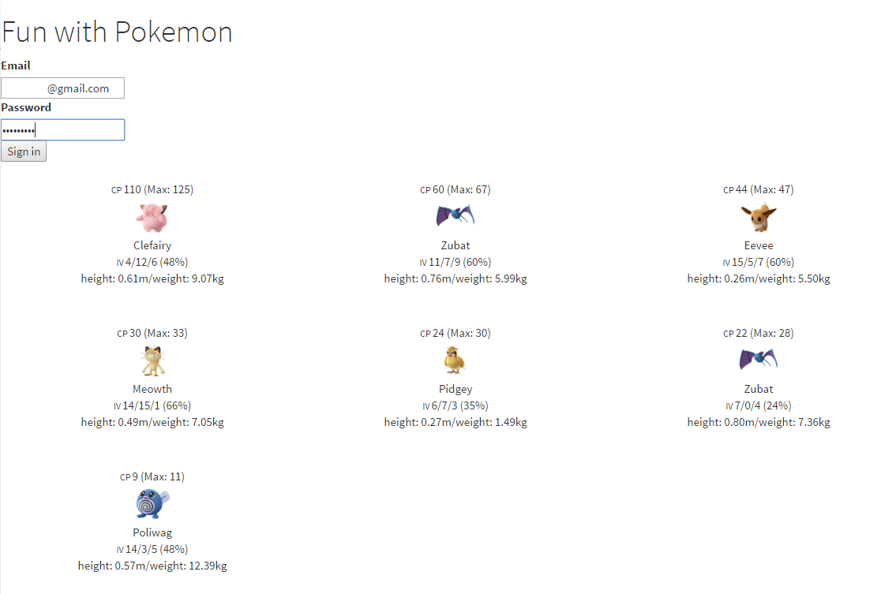

# Pokemon Diary
Restfulapi server for getting your pokemon's IV and other details including height, weight and nickname in JSON (Pokemon Go) with a delightful webUI

## Install
1. `npm install`
1. `npm install -g webpack`
2. `npm run all`

## Usage
* to acces the UI page
	* `http://localhost:8887/`
* to call the backend api
	* `curl -H "Content-Type: application/json" -X POST -d '{"username":"xxxxx", "password": "xxxxx"}'  http://localhost:8887/pokemon/list`

## Develop UI
`npm run ui-dev`

## Build UI
`npm run ui-build`

## Deploy with Docker
1. `docker build -t pkm-journal:latest .`
2. `docker run -d -p 9999:8887 --name=pokemon-journal pkm-journal:latest`

## Screenshot

## Demosite
http://ilcic.synology.me:9696/
